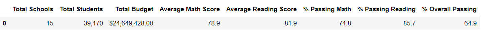
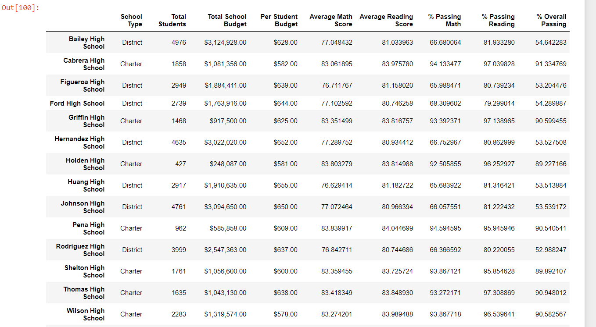
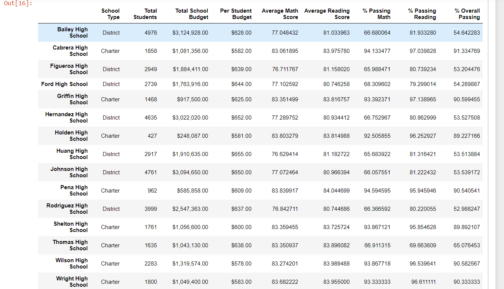
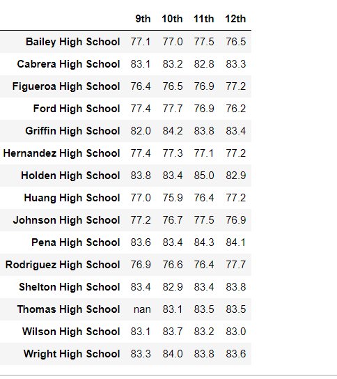
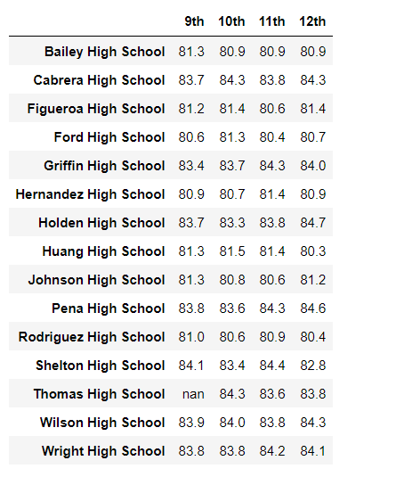
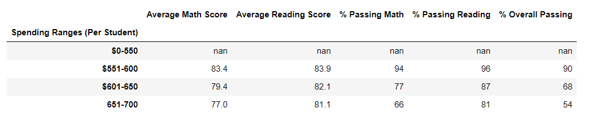
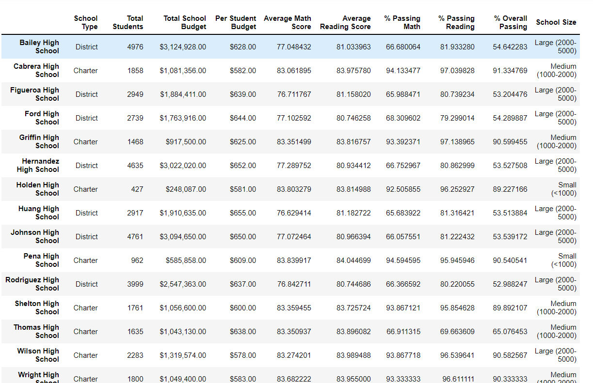
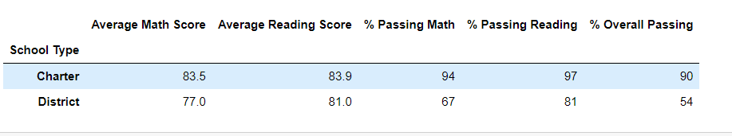

# School_District_Analysis
# Overview of the school district analysis 
  Notification received from school board that was evidence of academic dishonesty in the students.csv file. It appears that Thomas School ninth graders academic records have been tampered. Although full investigation has not been completed, they still want to uphold state-testing results and have reached out Maria for help. Maria has asked us to replace the math and reading scores for Thomas High School with NaNs while keeping the rest of the data intact. Once you’ve replaced the math and reading scores, Maria would like you to repeat the school district analysis that you did in this module and write up a report to describe how these changes affected the overall analysis.

# Results: 

  ## How is the district summary affected?

     
    

    

     ### Average Math Score
         Minimal decrease (Less that 1%) after removing 9th grade(Thomas High School) math scores
         
     ### Average Reading Score
         No change after removing  9th reading scores(Thomas High School)

     ### Math passing %
         Changed from 75 to 74.9 after removing 9th grade math scores

     ### Reading passing %
         Changed from 86 to 85.7 after removing 9th grade reading scores

     ### Overall passing %
         Changed from 65 to 64.9 after removing 9th grade math and reading scores
         
       
  ## How is the school summary affected?

    
    

    Thomas High School Overall passing percentage decreased from 90 to 65
    Average math score 83.4 to 83.35
    Average reading score chnaged from 83.84 to 83.89
    % passing math scores changed from 93.27 to 66.9
    % passing reading scores changed from 97.3 to 65

  ## How does replacing the ninth graders’ math and reading scores affect Thomas High School’s performance relative to the other schools?
   Thomas High Schoole was in 2nd position based on the overall passing percentage and then dropped to the 13th place
  ## How does replacing the ninth-grade scores affect the following:

  ## Math and reading scores by grade
 
  Thomas High School 9th grades show as nan and rest of the scores remained same

  Math:
    

   Reading
    

  ## Scores by school spending
    
   Thomas high school 9th grades were removed and observation was that Schools that had a spending range $551-600 had high scopring students in math and reading.

  ## Scores by school size
    
   Small- and medium-sized schools were on high performers list. Thomas high school is in the Medium size range due to the total count impacts

  ## Scores by school type
    
   Since Thomas high school is of Charter type, all the corresponding scores were impacted
 
# Summary: Summarize four changes in the updated school district analysis after reading and math scores for the ninth grade at Thomas High School have been replaced with NaNs.

Removing 9th grade student scores from Thomas High School affected the school district in the following ways:

Average math scores dropped 
Average reading scores were not affected
Percentage of students passing math dropped 
Percentage of students passing reading dropped
The overall passing rate dropped  
Only scores for Thomas High School were affected
Thomas High school dropped out of the top 5 high schools in the district
Math and reading scores by grade remained the same for all other schools
Scores by school size changed for medium-sized schools (1000-2000)
Scores by Charter school type were affected